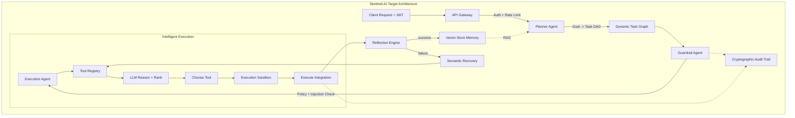

# Enterprise-Grade Agentic AI Workflow


A production-ready, multi-agent, event-driven, self-healing workflow orchestration system that autonomously executes complex enterprise workflows with full audit compliance, predictive SLA monitoring, and hierarchical failure recovery.

---

## ✨ Features

- **🧩 Multi-Agent Architecture** — 10 specialized agents (Orchestrator, Planner, Supervisor, Intake, Policy, Decision, Execution, Verification, Monitoring, Recovery)
- **🧠 Frontier Agentic Capabilities**:
  - **Dynamic Tool Registry**: Capability-based search, ranking, reliability tracking, and MCP auto-discovery.
  - **LLM-Driven Tool Selection**: Execution agents autonomously reason about and select the best tools based on schema and context.
  - **Dynamic Planner Agent**: Generates task DAGs from natural language goals at runtime.
  - **Reflection & Semantic Recovery**: Intelligent failure analysis and tool switching instead of blind retries.
  - **Agent Memory (Vector Store)**: Persistent ChromaDB-backed semantic search to recall successful tool sequences and recovery strategies.
  - **Dynamic Skill Loading**: Context-specific system prompts and tool preferences loaded on demand.
- **🛡️ Security-Hardened Pipeline**:
  - **JWT API Gateway**: Secure, stateless authentication with rate limiting and identity injection.
  - **Guardrail Agent**: Pre-execution security checks, injection detection, and strict policy enforcement.
  - **Execution Sandbox**: Strict operational boundaries including configurable timeouts and output payload constraints.
- **📊 DAG-Based Execution** — Parallel task execution with topological sorting, cycle detection, and dependency resolution
- **🔐 Cryptographic Audit Trail** — SHA-256 hash chain providing tamper-evident Agent Decision Records (AgDR)
- **⚡ Event-Driven** — Async pub/sub event bus with wildcard subscriptions and WebSocket real-time updates
- **🔄 Self-Healing** — 3-level failure recovery (Local → Orchestrator → Human Escalation) with circuit breakers
- **📈 SLA Monitoring** — Predictive deadline tracking with preemptive warnings
- **🤖 LLM Integration** — Pluggable OpenAI/Anthropic backends for intelligent reasoning
- **🎯 Pre-Built Workflows** — P2P, Meeting Intelligence, Employee Onboarding, Contract CLM
- **🖥️ Premium Dashboard** — Real-time monitoring UI with DAG visualization and KPI tracking

---

## 🚀 Quick Start

### Prerequisites
- Python 3.12+
- PostgreSQL (running on localhost:5432)

### Installation

```bash
# Clone and enter the project
cd "AI-Powered-agent-workflow"

# Create virtual environment
python -m venv venv
source venv/bin/activate  # Unix/macOS
venv\Scripts\activate     # Windows

# Install dependencies
pip install -r requirements.txt
```

### Database Setup

```bash
# Create PostgreSQL database
createdb sentinel_ai

# Or via psql:
# CREATE DATABASE sentinel_ai;
# CREATE USER sentinel WITH PASSWORD 'sentinel_pass';
# GRANT ALL PRIVILEGES ON DATABASE sentinel_ai TO sentinel;
```

### Configuration

Set environment variables for your LLM provider (optional):

```bash
export OPENAI_API_KEY="sk-your-key-here" # Unix/macOS
set OPENAI_API_KEY="sk-your-key-here"    # Windows

# Optional: use the Atlassian MCP server with custom credentials
export ATLASSIAN_API_TOKEN="your-atlassian-token" # Unix/macOS
set ATLASSIAN_API_TOKEN="your-atlassian-token"    # Windows
```

### Run

```bash
python -m sentinel_ai.main
```

Open your browser:
- **Dashboard**: http://localhost:8000/dashboard
- **API Docs**: http://localhost:8000/docs
- **Health Check**: http://localhost:8000/health

---

## 📋 API Usage

### Submit a Goal-Driven Workflow (Dynamic DAG)

```bash
curl -X POST http://localhost:8000/api/workflows/goal \
  -H "Content-Type: application/json" \
  -d '{
    "goal": "Process this invoice and create a Jira ticket for review",
    "constraints": {
      "time_limit_minutes": 30
    }
  }'
```

### Submit a Predefined Workflow (P2P)

```bash
curl -X POST http://localhost:8000/api/workflows/ \
  -H "Content-Type: application/json" \
  -d '{
    "workflow_type": "p2p",
    "priority": 7,
    "input_data": {
      "vendor_name": "Acme Corp",
      "invoice_number": "INV-2026-001",
      "total_amount": 15000,
      "po_number": "PO-9876"
    }
  }'
```

### Check Workflow Status

```bash
curl http://localhost:8000/api/workflows/{workflow_id}
```

### Verify Audit Chain

```bash
curl http://localhost:8000/api/audit/verify
```

---

## 🧪 Testing

```bash
pytest tests/ -v
```

### Strict Live P2P Scenario

Run a strict end-to-end P2P check (input → policy → decision → ERP actions → verification):

```bash
python scripts/run_strict_p2p_live.py
```

---

## 🏗️ Architecture



---

## 📄 License

MIT
